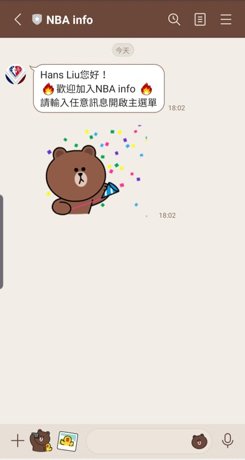
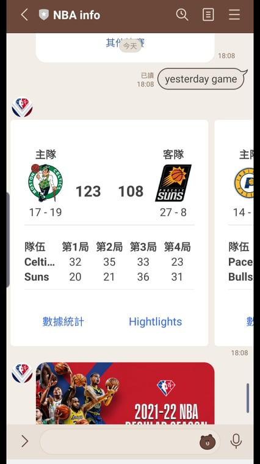

# ChatBot NBA info

:basketball: The NBA Line Bot with 6 features ! :basketball:


Watch game results, boxscores, check the schedule, standings and serch for favorite Teams 

## Setup

### Prerequisite
* Python 3.6
* Pipenv
* Facebook Page and App
* HTTPS Server

#### Install Dependency
```sh
pip3 install pipenv

pipenv --three

pipenv install

pipenv shell
```

## Finite State Machine
1. fsm example

2. fsm of NBA info


## Features



### Menu


### Watch Games
Check the scores of the games on that day(Can choose **today**, **yesterday** or **enter other date** you want to know)


1. **Today game**


2. **other date with hightlight links**



### Check Schedule

1. **Tommorrow's schedule** - 
Showing the game schedule today and tomorrow 


2. **Team's schedule** - 
Can select one team to show their next 5 games' schedule


### Show Standings
Showing the team standings


### Show Stats Leader
Showing the stat leaders. (PPG / Assists / Rebounds / 3PM / Steals / Blocks)


### Show NBA news
Show the latest 10 NBA news and links to the news


## Reference
[Pipenv](https://medium.com/@chihsuan/pipenv-更簡單-更快速的-python-套件管理工具-135a47e504f4) ❤️ [@chihsuan](https://github.com/chihsuan)

[TOC-Project-2019](https://github.com/winonecheng/TOC-Project-2019) ❤️ [@winonecheng](https://github.com/winonecheng)

Flask Architecture ❤️ [@Sirius207](https://github.com/Sirius207)

[Line line-bot-sdk-python](https://github.com/line/line-bot-sdk-python/tree/master/examples/flask-echo)
